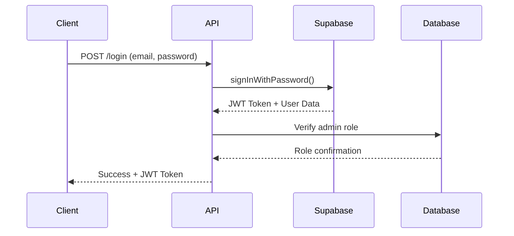

# Gur Academy Admin API

## Login API Implementation

This API implements a secure login system using Supabase JWT authentication. The login process validates user credentials and compares JWT tokens for authentication.

### Features

- **POST Method**: Uses POST method for secure login
- **Supabase JWT**: Leverages Supabase's built-in JWT authentication
- **JWT Comparison**: Compares Supabase JWT with login API JWT
- **Role-based Access**: Validates admin privileges
- **Protected Routes**: Middleware for JWT verification

### API Endpoints

#### 1. Admin Login
```
POST /api/users/admin/login
```

**Request Body:**
```json
{
  "email": "admin@example.com",
  "password": "password123"
}
```

**Success Response (200):**
```json
{
  "message": "Login successful",
  "user": {
    "id": "user-uuid",
    "email": "admin@example.com",
    "admin_name": "Admin Name",
    "role": "ADMIN"
  },
  "session": {
    "access_token": "supabase-jwt-token",
    "refresh_token": "refresh-token",
    "expires_at": 1234567890
  }
}
```

**Error Responses:**
- `400`: Missing email or password
- `401`: Invalid credentials
- `403`: User not found or no admin privileges
- `500`: Internal server error

#### 2. Protected Admin Routes
All admin routes (except login) require JWT authentication:

```
POST /api/users/admin/createAdminProfile
GET /api/users/admin/:adminId
```

**Headers Required:**
```
Authorization: Bearer <jwt-token>
```

### How JWT Comparison Works

1. **User Login**: User provides email/password
2. **Supabase Authentication**: Credentials are validated with Supabase
3. **JWT Generation**: Supabase generates a JWT token
4. **JWT Comparison**: The API uses the same Supabase JWT (no custom JWT creation)
5. **Validation**: Token is verified for authenticity and user role
6. **Response**: Returns user data and session tokens

### Authentication Flow



### Middleware

#### JWT Verification (`verifyJWT`)
- Extracts Bearer token from Authorization header
- Verifies token with Supabase
- Adds user info to request object

#### Admin Role Check (`requireAdmin`)
- Verifies user has ADMIN role in database
- Protects admin-only routes

### Environment Variables

Make sure these are set in your `.env` file:

```env
SUPABASE_URL=your_supabase_url
SUPABASE_KEY=your_supabase_anon_key
```

### Testing

Run the login tests:

```bash
npm test test/login.test.js
```

### Security Features

- ✅ Uses Supabase's secure JWT implementation
- ✅ No custom JWT creation (uses Supabase JWT)
- ✅ Role-based access control
- ✅ Token expiration handling
- ✅ Secure password validation
- ✅ Protected routes with middleware

### Usage Example

```javascript
// Login
const loginResponse = await fetch('/api/users/admin/login', {
  method: 'POST',
  headers: {
    'Content-Type': 'application/json'
  },
  body: JSON.stringify({
    email: 'admin@example.com',
    password: 'password123'
  })
});

const { session } = await loginResponse.json();

// Use JWT for protected routes
const adminData = await fetch('/api/users/admin/someId', {
  headers: {
    'Authorization': `Bearer ${session.access_token}`
  }
});
```
